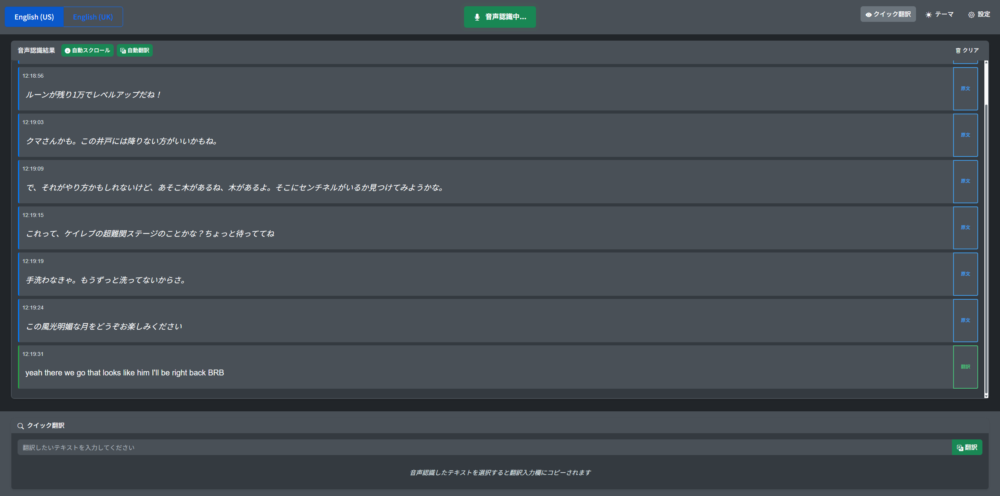

# English Speech to Text

英語音声をリアルタイムで認識・翻訳する個人用Webアプリケーションです。

## 🎯 想定用途

**個人用途限定**：英語VTuber配信などの音声をリアルタイム翻訳ツール

[外国語のライブ配信をリアルタイム翻訳する方法](https://love.ianthis.net/2023/05/06/post-48/) - このツールを作成するアイデアの元となったURLです。素晴らしい記事をありがとうございます。

## 🖥️ ウェブ画面

*リアルタイム英語音声認識。マイクボタンで音声認識を開始し、認識されたテキストがリアルタイムで表示されます。*

*下部のクイック翻訳エリアでGoogle Gemini APIによる自動翻訳。翻訳ボタンまたは自動翻訳で英語を日本語に翻訳できます。*

## ✨ 主要機能

### 🎤 音声認識
- リアルタイム英語音声認識、US・UK英語対応
- 連続音声認識とエラー自動復旧
- 中間結果表示と最終結果の自動確定
- 自動スクロール機能で認識結果を自動追跡

### 🌏 翻訳機能
- Google Gemini Flashによる高速な英語→日本語翻訳
- 自動翻訳、音声認識完了と同時に翻訳実行
- クイック翻訳、テキスト選択で翻訳入力欄に自動コピー
- カスタム翻訳スタイル設定、女性口調や丁寧語など自由にコンテキスト指定可能

### 📝 表示機能
- シンプルなテキスト表示
- ダークモード・ライトモード切り替え
- レスポンシブデザイン、主にPC向けでブラウザウィンドウサイズに対応
- テキスト表示行数制限でメモリ効率化

## 必要な環境

- **ブラウザ**: Chrome（推奨）、Edge（音声認識API対応）
- **音声入力**: マイクまたは仮想音声デバイス

## セットアップ

### 1. Google Gemini API キーの取得

1. [Google AI Studio](https://aistudio.google.com/) にアクセス
2. Googleアカウントでログイン
3. 「Get API Key」をクリックして新しいAPIキーを作成
4. APIキーをコピーして保存

### 2. 音声入力の設定

VoiceMeeterを使って仮想マイクを作成し、配信音声をその仮想マイクを通してブラウザに入力します。

詳細設定は [外国語のライブ配信をリアルタイム翻訳する方法](https://love.ianthis.net/2023/05/06/post-48/) を参考にしてください。

**動作確認：** [Google翻訳](https://translate.google.com/) で英語音声認識を試して、配信音声が認識されることを確認してください。

### 3. アプリケーションの起動

**方法1: GitHub Pages**
1. https://torachanmeow.github.io/english-speech-to-text/ にアクセス

**方法2: ローカル実行**
1. プロジェクトをダウンロード
2. `index.html` をブラウザで開く、またはIIS等のWebサーバーで設定

**注意：** APIキーはブラウザのローカルストレージに保存されます。より安全にAPIキーを管理したい場合は、ローカル実行をお勧めします。

**共通手順:**
1. 設定ボタンから Gemini API キーを入力
2. 言語選択（English US/UK）を選択
3. 緑色の「音声認識」ボタンをクリック
4. 英語を話すとリアルタイムで認識・翻訳されます

## 💡 使い方

### 🎛️ 基本操作

| 操作 | 説明 |
|------|------|
| **音声認識開始/停止** | 緑色のマイクボタンをクリック |
| **言語切り替え** | ヘッダーの「English (US)」「English (UK)」ボタン |
| **自動スクロール** | 認識結果の自動追跡ON/OFF |
| **自動翻訳** | 音声認識完了と同時に翻訳実行ON/OFF |
| **テーマ切り替え** | ダークモード・ライトモード切り替え |
| **テキストクリア** | 認識結果をすべて削除 |

### 🌏 翻訳機能の使い方

1. **自動翻訳**: 「自動翻訳」ボタンをONにすると音声認識完了時に自動翻訳
2. **クイック翻訳**: 認識されたテキストを選択すると翻訳入力欄に自動コピー
3. **手動翻訳**: 翻訳エリアに直接テキストを入力して「翻訳」ボタン
4. **翻訳スタイル**: 設定で翻訳の口調・スタイルをカスタマイズ可能

### ⚙️ 設定項目

| 設定項目 | 説明 |
|----------|------|
| **Gemini APIキー** | 翻訳機能に必要（[取得方法](#1-google-gemini-api-キーの取得)） |
| **Geminiモデル** | 翻訳精度と速度のバランス調整 |
| **最大表示行数** | 認識結果の保持数（0=無制限、メモリ節約推奨値：50） |
| **翻訳スタイル** | 翻訳時の口調指定（例：丁寧語、カジュアル等） |

## 対応モデル

| モデル | 特徴 |
|--------|------|
| Gemini 2.5 Flash-Lite | 高速・軽量（推奨） |
| Gemini 2.0 Flash-Lite | バランス型・軽量 |
| Gemini 2.0 Flash | 標準・安定 |
| Gemini 1.5 Flash | 従来型・実績 |

## 注意事項

- **API利用料**: Google Gemini APIの使用料は自己負担
- **精度について**: 音声認識精度はWeb Speech APIに依存し、環境や話者により変動
- **英語方言**: アメリカ英語(US)とイギリス英語(UK)に対応していますが、方言や訛りにより精度が変動する場合があります

## トラブルシューティング

### 音声認識が動作しない

- ブラウザのマイク権限を確認
- 正しい音声入力デバイスが選択されているか確認
- Voicemeeter の設定とルーティングを確認

### 翻訳が動作しない

- Gemini APIキーが正しく設定されているか確認
- インターネット接続を確認
- APIキーの使用制限を確認

### 音声が途切れる

- 音声入力レベルを調整
- ブラウザのタブがアクティブであることを確認
- PCの性能とネットワーク状況を確認

## 使用ライブラリ
- [Bootstrap 5](https://getbootstrap.com/) - MIT License
- [Bootstrap Icons](https://icons.getbootstrap.com/) - MIT License
- [jQuery](https://jquery.com/) - MIT License
